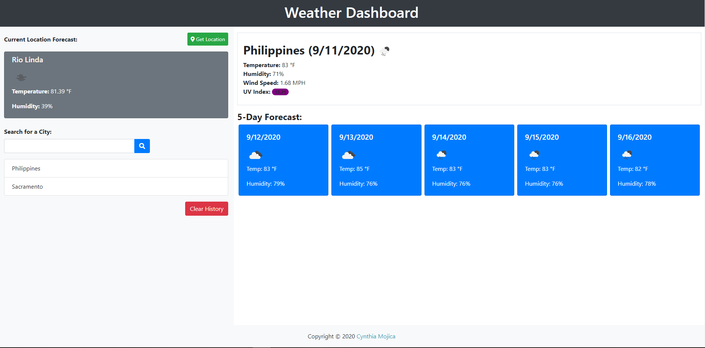

# Weather Dashboard App

A weather dashboard with search functionality to find current weather conditions and the future weather outlook for multiple cities.

# Purpose

Build my first app using an API. Retrieve data from a third-party weather API (OpenWeather API) and using it in context.

# Functionality

Build a weather dashboard application with search functionality to find current weather conditions and the future weather outlook for multiple cities.

[Deployed Link](https://cynmojica1231.github.io/Homework6/)

# Weather dashboard Screenshots

# Resources

[Open Weather](https://openweathermap.org/). It uses their APIs for current weather, 5 day / 3 hour weather forecast, and UV Index.
[Chrome](https://www.google.com/chrome/) web browser.

[https://getbootstrap.com/](https://getbootstrap.com/) - Bootstrap framework  
[https://jquery.com/](https://jquery.com/) - jQuery library  
